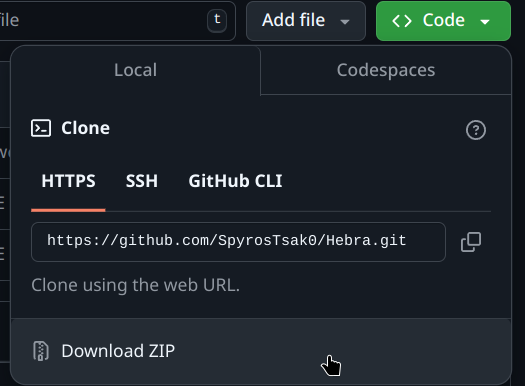

# Hebra
**Hebra** (short for "HEad BRAnches") is a Python-based tool designed to manage and enable the automatic deletion of head branches on GitHub. Currently in its early development stages, Hebra utilizes the GitHub API to enable the feature of cleaning up branches when accepting pull requests and merging to the main branch. As it is still in its initial phases, the tool runs through the Python interpreter for now. Future updates are bound to come and any contributions are extremely welcome.

## Table of Contents
[1.  Installation](#installation)<br>
[2.  Usage](#usage)<br>
[3.  Contributing](#contributing)<br>
[4.  License](#license)

### Installation
For now, you can get and test the program on your machine by either:<br>

- Cloning its repository using git: 
```
git clone https://github.com/SpyrosTsak0/Hebra.git
```
- Or by downloading it as a zip through Github's website:<br>


### Usage
As Hebra is still in its early development, it currently uses the python interpreter to work. To run the main script, type:
```
python hebra.py ([arguments]) ([options])
```
Replace `[arguments]` and `[options]` with any required arguments or options.

To view a full list of available commands and usage options, you can either:
- Request the [help page](data/help.txt):
```
python hebra.py --help
```
- Or run the main script without any arguments or options:
```
python hebra.py
```

### Contributing
Contributions are very welcome. Feel free to submit a pull request, open an issue, or suggest improvements.

- Fork the repository
- Create a feature branch (`git checkout -b feature-branch`)
- Commit your changes (`git commit -am 'Add new feature'`)
- Push to the branch (`git push origin feature-branch`)
- Open a pull request

### License
This project is licensed under the MIT License - see the [LICENSE](LICENSE) file for details.
